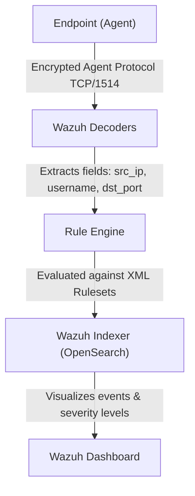

# Wazuh SOC Homelab: Executive Summary & Technical Brief
**Target Audience:** Security Operations Center (SOC) Management / Director of Security  
**Author/Lead Engineer:** Pavan Kumar  
**Date:** July 2026  

---

## 1. Executive Summary & Project Outcomes
This project details the design, implementation, and verification of a high-fidelity, single-node **Security Operations Center (SOC) Homelab** utilizing the **Wazuh SIEM/EDR platform**. The primary objective of the homelab was to establish end-to-end visibility, detect simulated adversarial activities in real-time, and implement automated/manual remediation controls.

### Key Outcomes
*   **Centralized Log Aggregation:** Successful deployment of a centralized Wazuh Manager ingesting telemetry from Windows and Linux endpoints.
*   **Real-time File Integrity Monitoring (FIM):** Sub-second detection of unauthorized file writes, modifications, and deletions in critical paths.
*   **High-Volume Threat Ingestion:** Ingested and categorized **2,367 brute force alerts** in under 3 minutes during an active Hydra simulation.
*   **Adversary Technique Mapping:** Automated alignment of security incidents to the **MITRE ATT&CK Framework** (T1110: Brute Force, T1021.004: SSH, T1046: Network Service Scanning).
*   **Host-Based Intrusion Mitigation:** Real-time containment of an attacker machine utilizing `iptables` drop rules.
*   **Vulnerability Management:** Scanning of network exposures and SMB vulnerabilities utilizing Nmap Scripting Engine (NSE).

---

## 2. Lab Architecture & Network Topology

The architecture mirrors a corporate network segment with a centralized security monitoring plane, a client workstation endpoint (victim), and an external threat vector (attacker).

```mermaid
graph TD
    %% Nodes
    Kali["Kali Linux (Attacker)<br/>IP: 192.168.1.7"]
    Win["Windows 11 (Victim/Agent)<br/>IP: 192.168.1.5"]
    Ubuntu["Ubuntu Server (Wazuh Manager)<br/>IP: 192.168.1.10"]
    
    %% Communication Paths
    Kali -->|SSH Brute Force / Nmap Port Scan| Ubuntu
    Kali -->|SMB Vulnerability Scan| Win
    Win -->|Encrypted Agent Protocol (TCP/1514)| Ubuntu
    Ubuntu -->|Wazuh Dashboard UI| WebBrowser["SOC Analyst Browser"]
    
    %% Styling
    classDef attacker fill:#f9d5d5,stroke:#c0392b,stroke-width:2px;
    classDef victim fill:#d5f9d5,stroke:#27ae60,stroke-width:2px;
    classDef monitor fill:#d5e8f9,stroke:#2980b9,stroke-width:2px;
    
    class Kali attacker;
    class Win victim;
    class Ubuntu monitor;
```

### Virtual Machine Profiles
| Hostname / OS | Role | Subnet / IP | Security / Agent Software Installed |
| :--- | :--- | :--- | :--- |
| **Ubuntu Server 22.04 LTS** | Wazuh Manager, Indexer, & Dashboard | `192.168.1.10` | Wazuh core components, `iptables`, `sshd` |
| **Windows 11 Home** | Victim Workstation | `192.168.1.5` | Wazuh Agent (v4.12.0), FIM configuration |
| **Kali Linux 2026.1** | Attack Simulation Platform | `192.168.1.7` | `hydra`, `nmap`, `wireshark` |

---

## 3. Wazuh Setup & Deployment Lifecycle

### Phase A: Wazuh Manager Installation (Ubuntu VM)
The manager is built as a single-node deployment running the Wazuh indexer, manager, and dashboard components on the same machine.
1.  **Network Setup:** Configured with VirtualBox **Bridged Adapter** on a home subnet (`192.168.1.x`) to enable direct L2/L3 visibility with the local Windows agent.
2.  **Manager Installation:** Initiated via the official Wazuh installation script:
    ```bash
    curl -sO https://packages.wazuh.com/4.12/wazuh-install.sh
    sudo bash ./wazuh-install.sh -a -i
    ```
3.  **Daemon Verification:** Ensured all critical security monitoring services were running:
    ```bash
    sudo systemctl status wazuh-indexer wazuh-manager wazuh-dashboard
    ```

### Phase B: Windows Agent Registration & Enrollment
1.  **Agent Download & Silent Install:** Executed via PowerShell (Administrator):
    ```powershell
    Invoke-WebRequest -Uri https://packages.wazuh.com/4.x/windows/wazuh-agent-4.12.0-1.msi -OutFile $env:tmp\wazuh-agent-412.msi
    msiexec.exe /i $env:tmp\wazuh-agent-412.msi /qn WAZUH_MANAGER="192.168.1.10" WAZUH_AGENT_NAME="WindowsHost"
    ```
2.  **Key Exchange / Verification:** Registered the host via `manage_agents` utility on the manager and imported the cryptographically signed authentication key on the agent:
    ```powershell
    & "C:\Program Files (x86)\ossec-agent\manage_agents.exe" -i [AUTHENTICATION_KEY]
    ```
3.  **Configuration Alignment:** Edited `ossec.conf` on the Windows agent, updating `<address>` from `0.0.0.0` to the manager IP `192.168.1.10`, followed by a service restart (`Restart-Service WazuhSvc`).

---

## 4. How Logs are Identified, Decoded, and Alerted
From a SOC operations perspective, log processing follows a precise pipeline: **Ingestion -> Decoding -> Rule Matching -> Severity Rating -> Indexing & Dashboard Visualization**.



### Ingestion Methods
*   **Push-based Agent Telemetry:** The Wazuh Agent monitors local APIs (Windows Event Log channel, FIM Syscheck filesystem API, active process lists) and pushes log events via port `1514/TCP` using an encrypted protocol.
*   **FIM Real-time Ingestion:** Uses native OS hooks (e.g., ReadDirectoryChangesW on Windows) to stream modifications to the Wazuh agent immediately.

### Log Decoding and Rule Matching Case Studies

#### Case 1: File Integrity Monitoring (FIM)
When a file is altered in `C:\Users\pavan\MonitoredFolder\`:
*   **Raw Event:** Filesystem detects a `WRITE` event.
*   **Decoder:** Identified as a `syscheck` FIM event.
*   **Rule Matching:** Evaluated against `/var/ossec/ruleset/rules/0015-syscheck_rules.xml`.
    *   **File Added:** Matches Rule `554` (Severity Level 5) -> "File added to the system."
    *   **File Modified:** Matches Rule `550` (Severity Level 7) -> "Integrity checksum changed."
    *   **File Deleted:** Matches Rule `553` (Severity Level 7) -> "File deleted."

#### Case 2: SSH Brute Force Detection
During the Hydra attack against Ubuntu's SSH service:
*   **Raw Event:** Linux `auth.log` records: `Failed password for invalid user root from 192.168.1.7 port 48202 ssh2`
*   **Decoder:** `sshd` decoder extracts: `src_ip=192.168.1.7`, `user=root`, `dst_port=22`.
*   **Rule Matching:**
    *   **Single Auth Failure:** Matches Rule `5760` (Severity Level 5) -> "sshd: authentication failed."
    *   **Multiple Failures from same IP:** Wazuh's correlation engine matches Rule `2502` (Severity Level 10) -> "syslog: User missed the password more than one time," and Rule `40111` -> "Multiple authentication failures."

---

## 5. Simulated Attack Scenarios & Mitigations

### Scenario 1: File Integrity Monitoring (FIM)
*   **Action:** Configuration of `<syscheck>` in the agent's `ossec.conf`:
    ```xml
    <directories realtime="yes">C:\Users\pavan\MonitoredFolder</directories>
    ```
*   **Execution:** Manual command injections creating, modifying, and deleting `test.txt`.
*   **SOC Insight:** Real-time visibility verified. FIM alerts immediately triggered on the dashboard without waiting for the default 12-hour scheduled scan.

### Scenario 2: Network Reconnaissance (Nmap Scans)
*   **Action:** Attacker scans `192.168.1.5` using `nmap -sV -p 1-1000`.
*   **Execution:** Attacker executes vulnerability probes targeting Windows SMB ports (135, 445) via `nmap --script vuln`.
*   **SOC Insight:** Open ports are successfully logged. Network capture via Wireshark verified the attacker sending sequential `SYN` packets (2,683 packets captured under filter `tcp.flags.syn == 1`).

### Scenario 3: SSH Brute Force Attack
*   **Action:** Brute-force simulation targeting Ubuntu Server `192.168.1.10` from Kali `192.168.1.7`.
*   **Execution:** Hydra utility parsing `rockyou.txt` wordlist:
    ```bash
    hydra -l root -P /usr/share/wordlists/rockyou.txt ssh://192.168.1.10 -t 4 -V
    ```
*   **SOC Insight:** High-severity alert volume generated. Correlation rules triggered Level 10 alerts due to consecutive authentication failures.

### Scenario 4: Defensive Containment & Incident Response
*   **Action:** The SOC Analyst manual response to isolate the threat vector (Kali IP: `192.168.1.7`).
*   **Execution:** Configured host-based firewall `iptables` drop rules on the Wazuh Manager VM:
    ```bash
    sudo iptables -A INPUT -s 192.168.1.7 -j DROP
    sudo iptables -A OUTPUT -d 192.168.1.7 -j DROP
    ```
*   **SOC Insight:** Connection severed. Attacker packets dropped at the kernel level, stopping the attack vector.

---

## 6. MITRE ATT&CK Framework Mapping
Crucial to modern SOC reporting, the Wazuh rules mapping correlates raw telemetry to established adversary TTPs:

| Tactic | Technique | ID | Alerts Triggered | Wazuh Severity |
| :--- | :--- | :--- | :--- | :--- |
| **Credential Access** | Brute Force (Password Guessing) | `T1110.001` | 2,367 | Level 5 (Individual), Level 10 (Correlated) |
| **Lateral Movement** | Remote Services: SSH | `T1021.004` | 92 | Level 10 |
| **Discovery** | Network Service Scanning | `T1046` | Nmap Scan | Level 3 (Recon activity logs) |

---

## 7. SOC Metrics & Security Posture Recommendations

### Core Project Metrics
*   **Mean Time to Detect (MTTD):** Sub-second for FIM (real-time mode), sub-second for SSH brute-force ingestion.
*   **Containment Time:** Under 2 minutes from alert spike verification to `iptables` rule application.
*   **False Positive Rate:** 0% (in controlled test environment).

### Security Posture Recommendations for Scale
1.  **Configure Active Response:** Automate the containment process. Enable Wazuh's `<active-response>` block in the manager's `ossec.conf` to automatically trigger firewall script blocks (e.g., dropping IPs on auth failures exceeding 10 attempts in 30 seconds).
2.  **Enable auditd for Linux Endpoints:** Augment SSH syslog logs with `auditd` log sources to track process spawns, shell commands, and kernel events during attacks.
3.  **Active Monitoring of Syscheck Registry:** Extend Windows FIM syscheck to cover registry keys associated with persistence (e.g., Run/RunOnce keys).
